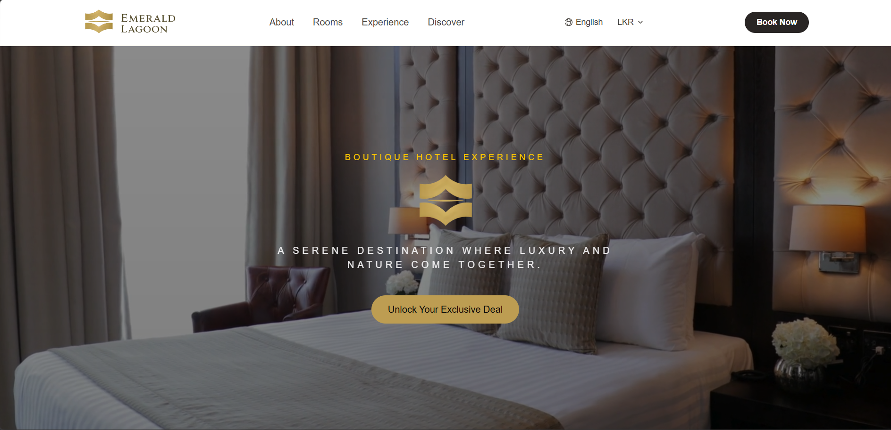
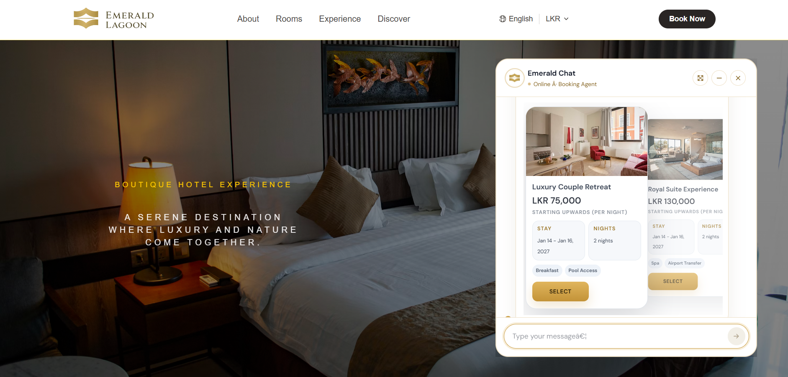
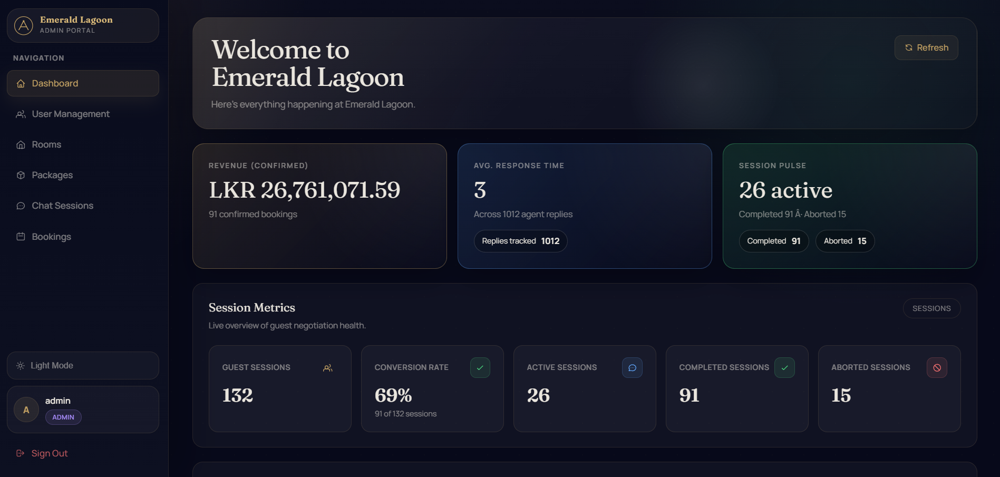

# Emotiate Frontend

A hotel management and guest negotiation platform built with React, TypeScript, and Vite. Emotiate provides a public-facing hotel homepage with an emotion-aware chat interface for guests, and a full-featured admin panel for hotel staff.

---

## Screenshots

### Hotel Homepage


### Chat Interface


### Admin Dashboard


---

## Features

### Guest-Facing
- **Hotel Homepage** - Browse featured packages, view room details, and explore hotel amenities.
- **Chat & Negotiation** - Real-time chat powered by WebSocket (STOMP over SockJS). Guests can negotiate pricing, ask questions, and receive package recommendations.
- **Emotion Detection** - Detects guest emotions (Frustrated, Hesitant, Neutral, Interested, Satisfied, Excited) to adapt responses.
- **Currency Toggle** - Switch between LKR and USD for package pricing.

### Admin Panel (`/admin`)
- **Dashboard** - Overview of bookings, sessions, and key metrics with charts (Recharts).
- **User Management** - Create, update, and deactivate staff/admin accounts (ADMIN only).
- **Room Management** - Add and manage hotel rooms by type (Single, Double, Deluxe, Suite, Family).
- **Package Management** - Create and manage booking packages with add-ons (Breakfast, Spa, Airport Transfer, etc.).
- **Session Management** - Monitor and review negotiation sessions with full chat history.
- **Booking Management** - View and manage all bookings with status tracking (Pending, Confirmed, Cancelled, No-Show).
- **Dark / Light Theme** - Theme preference is saved across sessions.

---

## Tech Stack

| Category | Library |
|---|---|
| Framework | React 19 + TypeScript |
| Build Tool | Vite 8 |
| Styling | Tailwind CSS 4 + MUI 7 (Material UI) |
| Routing | React Router DOM 7 |
| Real-time | STOMP.js + SockJS |
| Charts | Recharts |
| Icons | MUI Icons Material |

---

## Getting Started

### Prerequisites

- Node.js 18+
- A running instance of the Emotiate backend (default: `http://localhost:8080`)

### Installation

```bash
cd emotiate-frontend
npm install
```

### Development

```bash
npm run dev
```

The app will be available at `http://localhost:3000`.

### Build

```bash
npm run build
```

### Preview Production Build

```bash
npm run preview
```

---

## Environment Variables

Create a `.env` file in the `emotiate-frontend` directory to override defaults:

```env
VITE_API_URL=http://localhost:8080
```

`VITE_API_URL` is used by both the REST API client and the WebSocket chat connection.

---

## Project Structure

```
src/
├── api.ts               # API client with auth token handling
├── types.ts             # Shared TypeScript types and DTOs
├── App.tsx              # Root router (Home vs Admin routes)
├── context/
│   ├── AuthContext.tsx  # JWT auth state (login/logout)
│   └── ThemeContext.tsx # Dark/light theme state
├── pages/
│   ├── Home.tsx             # Public hotel homepage
│   ├── ChatInterface.tsx    # Guest chat widget
│   ├── Dashboard.tsx        # Admin dashboard with metrics
│   ├── UserManagement.tsx   # Admin: user CRUD
│   ├── RoomManagement.tsx   # Admin: room CRUD
│   ├── PackageManagement.tsx# Admin: package CRUD
│   ├── SessionManagement.tsx# Admin: negotiation session viewer
│   └── BookingManagement.tsx# Admin: booking manager
└── components/
    ├── Sidebar.tsx      # Admin navigation sidebar
    ├── AdminPanel.jsx   # Admin panel shell
    └── Shared.tsx       # Shared UI components
```

---

## Authentication

The admin panel is protected by JWT authentication. Tokens are stored in `localStorage` under `el_token`. Roles:

| Role | Access |
|---|---|
| `ADMIN` | Full access including User Management |
| `STAFF` | All pages except User Management |
| `GUEST` | Guest chat interface only |

---
